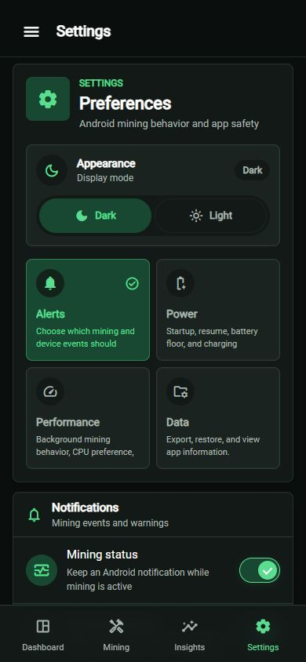

# AndroMiner

AndroMiner is an Android crypto mining app built with Vue 3, TypeScript, Vite, Tailwind CSS, Capacitor, and a native Android miner bridge. Designed for real Android mining with a native ARM64 XMRig-compatible backend, live telemetry, and direct miner process integration.

> [!CAUTION]
> Mining keeps the CPU busy for long periods. It can heat the phone, drain battery, reduce battery health, and make some devices unstable.
> The maintainers are not responsible for device damage, data loss, instability, or issues caused by installation, use, modified builds, or third-party distributions.
> **Use it at your own risk.**

> [!TIP]
> For maximum transparency and safety, clone the repository and build the app yourself rather than relying on prebuilt binaries.

## Which APK Should I Use?

GitHub releases publish three Android APKs:

| APK                             | Includes miner?   | Target SDK | Use this when                                                                |
| ------------------------------- | ----------------- | ---------- | ---------------------------------------------------------------------------- |
| `androminer-tls-<tag>.apk`      | Yes, TLS miner    | 35         | You want the recommended modern Android build with encrypted pool support.   |
| `androminer-notls-<tag>.apk`    | Yes, no-TLS miner | 35         | You only need plain TCP pool connections.                                    |
| `androminer-download-<tag>.apk` | No                | 28         | You want the app to ask before downloading TLS or no-TLS miner on first run. |

The downloader APK targets SDK 28 because Android blocks target SDK 29+ apps from executing downloaded app-private binaries. The bundled TLS and no-TLS APKs target SDK 35 and avoid that runtime download limitation.

## Device Requirements

| Requirement        | Minimum               | Recommended         |
| ------------------ | --------------------- | ------------------- |
| Android OS install | Android 6.0+ / API 23 | Android 10+         |
| Architecture       | ARM64 / `arm64-v8a`   | ARM64 / `arm64-v8a` |
| CPU                | 4 threads             | 4+ threads          |
| RAM                | 2 GB                  | 4 GB+               |
| Power              | Battery supported     | Plugged in          |
| Internet           | Required              | Stable connection   |

> [!NOTE]
> 32-bit Android devices are not supported. I don't have access to a 32-bit device for testing, and XMRig's Android support focuses on ARM64. Pull requests to add 32-bit support are welcome, but it is not a priority for this project.

## Miner Download And Safety

Official XMRig releases do not ship Android binaries. AndroMiner builds XMRig from source in this repo and publishes TLS and no-TLS `libxmrig.so` files to the [`miner-builder`](https://github.com/Stawa/AndroMiner/tree/miner-builder) branch.

If you use the downloader APK, the app asks before downloading or running the miner for the first time. You choose TLS or no-TLS in the app.

> [!NOTE]
> VirusTotal and antivirus products may flag XMRig or APKs that include it as malware, trojan, or cryptocurrency miner software. That is common for miner binaries. AndroMiner is open source, the miner download requires user consent, and the app is intended to mine only to the wallet and pool settings you enter.

## Build Locally

> [!IMPORTANT]
> If you want to build the app yourself, you must also build the miner locally. Windows are sensitive with miner binaries, I suggest to turn off Windows Defender real-time or add an exclusion for the `android/` and `miner-builder/` directories while building and testing.

### Requirements

| Tool                       | Version / Notes                |
| -------------------------- | ------------------------------ |
| Node.js                    | 22+                            |
| npm                        | 10+                            |
| JDK                        | 21+                            |
| Android Studio / SDK tools | Required                       |
| Android SDK Platform       | 35                             |
| Gradle                     | Wrapper included in `android/` |

Build the web app and Android debug APK:

```powershell
npm install
npm run android:sync
cd android
.\gradlew.bat assembleDebug
```

Build with a locally bundled miner:

```powershell
.\miner-builder\build-xmrig-android.ps1
npm run android:sync
cd android
.\gradlew.bat assembleDebug -PbundleMiner=true
```

Build the downloader release variant:

```powershell
cd android
.\gradlew.bat assembleRelease -PtargetSdkVersionOverride=28
```

More build details are in [docs/TECHNICAL.md](docs/TECHNICAL.md) and [miner-builder/README.md](miner-builder/README.md).

## Code Formatting

Format the web app:

```powershell
npm run format
```

Format Android Java, Gradle, XML, properties, and ProGuard files:

```powershell
.\scripts\format-android.ps1
```

Check Android formatting without changing files:

```powershell
.\scripts\format-android.ps1 -Check
```

## Supported Mining

AndroMiner is focused on phone CPU mining with the bundled Android ARM64 XMRig binary.
The app includes presets for coins and algorithms that XMRig can launch directly.

| Coin                    | Symbol  | XMRig algorithm   | Status               |
| ----------------------- | ------- | ----------------- | -------------------- |
| Monero                  | XMR     | `rx/0`            | Bundled XMRig preset |
| Zephyr Protocol         | ZEPH    | `rx/0`            | Bundled XMRig preset |
| Wownero                 | WOW     | `rx/wow`          | Bundled XMRig preset |
| ArQmA                   | ARQ     | `rx/arq`          | Bundled XMRig preset |
| Safex Cash              | SFX     | `rx/sfx`          | Bundled XMRig preset |
| KevaCoin                | KVA     | `rx/keva`         | Bundled XMRig preset |
| Raptoreum               | RTM     | `gr`              | Bundled XMRig preset |
| Yerbas                  | YERB    | `gr`              | Bundled XMRig preset |
| GSP Coin                | GSPC    | `gr`              | Bundled XMRig preset |
| Chukwa-compatible pools | CHUKWA  | `argon2/chukwa`   | Bundled XMRig preset |
| Chukwa v2 pools         | CHUKWA2 | `argon2/chukwav2` | Bundled XMRig preset |
| NinjaCoin               | NINJA   | `argon2/ninja`    | Bundled XMRig preset |
| Conceal                 | CCX     | `cn/ccx`          | Bundled XMRig preset |
| Talleo                  | TLO     | `cn-pico/tlo`     | Bundled XMRig preset |

Some coins are shown in the app catalog for visibility, but they are disabled until
AndroMiner has support for the required miner binary:

| Coin  | Symbol | Required miner support                   |
| ----- | ------ | ---------------------------------------- |
| Scala | XLA    | XLArig or another Panthera-capable miner |
| Dero  | DERO   | Current DERO miner / AstroBWT flow       |
| Vkax  | VKAX   | XMRigCC-style build with the Mike algo   |

Pool endpoints, ports, wallet formats, and active coin algorithms can change. Always
check the pool's current setup guide before mining, especially for smaller coins.

Bitcoin, Litecoin, Ethereum Classic, Ravencoin, and other GPU/ASIC-focused coins are not practical targets for this Android CPU miner.

## App Overview

| System Check                                                                | Dashboard                                                             |
| --------------------------------------------------------------------------- | --------------------------------------------------------------------- |
|  |  |

| Mining Setup                                                                | Statistics                                                              |
| --------------------------------------------------------------------------- | ----------------------------------------------------------------------- |
|  |  |

| Settings                                                             | Live Session                                                                       |
| -------------------------------------------------------------------- | ---------------------------------------------------------------------------------- |
|  |  |

## More Documentation

- [Technical notes](docs/TECHNICAL.md)
- [Miner builder](miner-builder/README.md)
- [XMRig command-line options](https://xmrig.com/docs/miner/command-line-options)
- [XMRig algorithms](https://xmrig.com/docs/algorithms)

## License

This project is licensed under the [MIT License](LICENSE).

## Contributors

<a href="https://github.com/Stawa/AndroMiner/graphs/contributors">
  
</a>
