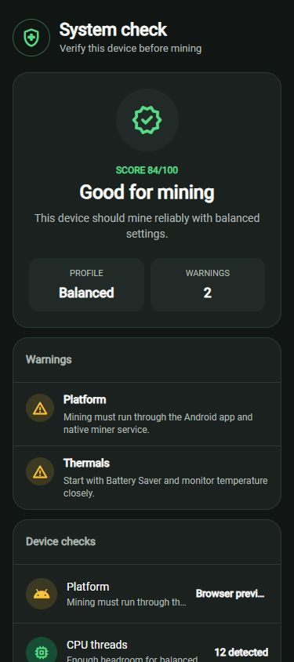
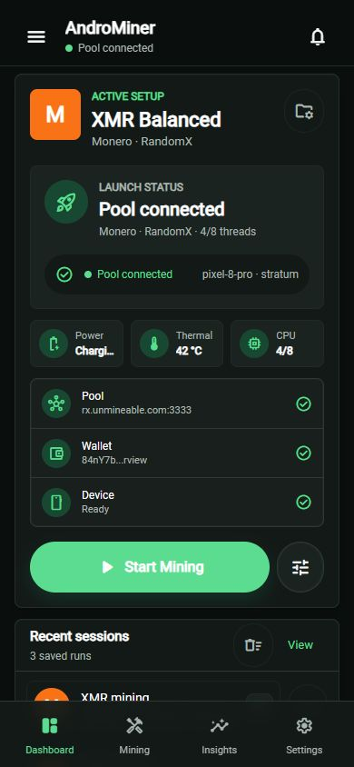
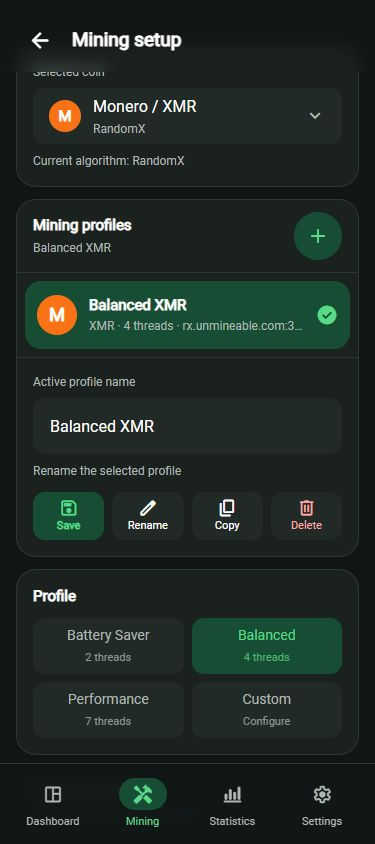
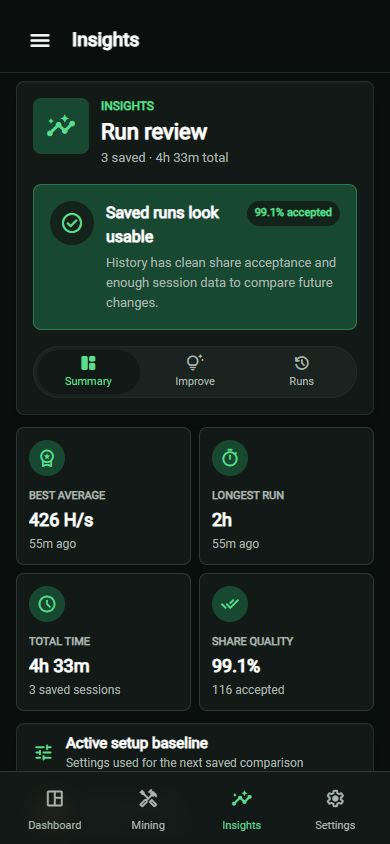
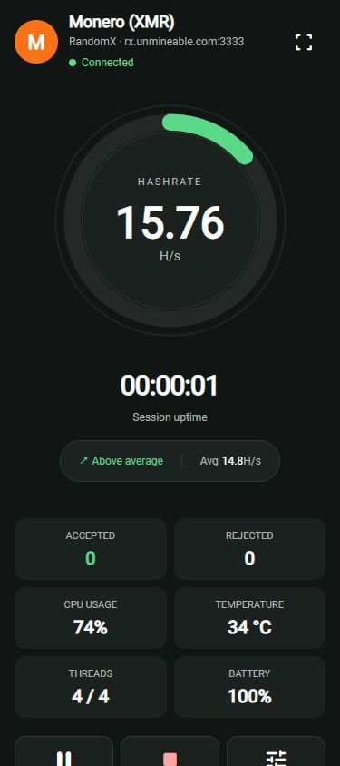

# AndroMiner

AndroMiner is an Android-focused cryptocurrency mining app built with Vue 3, TypeScript, Vite, Tailwind CSS, Capacitor, and a native Android miner bridge. The app is designed around real pool mining, Android device safety, reusable mining profiles, foreground status notifications, and direct control of an XMRig-compatible native miner process.

> [!CAUTION]
> Use this app at your own risk. We are not responsible for any damage, data loss, or device issues caused by installation or use.
> The project is open source, and risks from modified or third-party builds are outside our responsibility.
> This app has been tested by the maintainer on personal devices before being published. However, environments and builds may differ, so use discretion when installing or building.

> [!TIP]
> For maximum safety, clone the repository and build the app yourself instead of using prebuilt releases.

## Project Requirements

| Requirement                | Version / Notes                |
| -------------------------- | ------------------------------ |
| Node.js                    | 22+                            |
| npm                        | 10+                            |
| JDK                        | 21+                            |
| Android Studio / SDK tools | Required for Android builds    |
| Android SDK Platform       | 35                             |
| Gradle                     | Wrapper included in `android/` |

## Device Requirements

| Requirement     | Minimum           | Recommended          |
| --------------- | ----------------- | -------------------- |
| Android version | 6.0+              | 10+                  |
| Architecture    | -                 | ARM64                |
| CPU             | 4 threads         | 4+ threads           |
| RAM             | 2 GB              | 4 GB                 |
| Power           | Battery supported | Plugged-in preferred |
| Thermal state   | Safe temperature  | Stable/cool device   |
| Internet        | Required          | Stable connection    |

> [!NOTE]
> Official XMRig releases do not ship Android binaries. Real mining starts only when you build an Android-compatible miner from source and package it with the APK as `libxmrig.so`.

## Actual Mining Backend

This repository now includes a working build path for Android ARM64 XMRig through [`miner-builder/`](miner-builder/). The current local miner build is:

| Component               | Version / source                                     |
| ----------------------- | ---------------------------------------------------- |
| XMRig                   | `v6.26.0` from `xmrig/xmrig`                         |
| Commit                  | `b2ca72480c58d197e18c885d9fc1a0c8d517e60a`           |
| libuv                   | `v1.48.0`                                            |
| OpenSSL builder target  | `openssl-3.3.2`                                      |
| ABI                     | `arm64-v8a`                                          |
| Output                  | `android/app/src/main/jniLibs/arm64-v8a/libxmrig.so` |
| Current packaged binary | OpenSSL/TLS-enabled ARM64 XMRig                      |

The Android app registers a native `NativeMiner` Capacitor plugin that:

- Finds a packaged XMRig-compatible Android binary from the app native library directory as `libxmrig.so`.
- Starts the miner with real pool arguments: `--algo`, `--url`, `--user`, `--pass`, `--threads`, `--cpu-priority`, `--tls` when required, and `--print-time=2`.
- Reads miner stdout and updates real hashrate, accepted shares, rejected shares, active thread count, uptime, and recent miner logs.
- Refuses to fake a mining session on the web build or when the native binary is missing.

Frontend settings currently wired into the native miner:

| App setting              | Native miner behavior                                                          |
| ------------------------ | ------------------------------------------------------------------------------ |
| Coin / algorithm         | Passed as the XMRig algorithm, for example `rx/0` for Monero.                  |
| Pool URL, port, protocol | Converted into the XMRig `--url` endpoint.                                     |
| Wallet, worker, password | Passed as `--user` and `--pass`; worker names are appended as `wallet.worker`. |
| Thread count             | Passed directly as `--threads=N`.                                              |
| CPU priority             | Passed as `--cpu-priority=0`, `1`, or `2`.                                     |

Reserved UI settings that are not fully native yet: CPU affinity, huge pages, and complete XMRig JSON/API telemetry.

To package a miner binary, compile XMRig or an XMRig-compatible fork for the target Android ABI with the Android NDK and place the executable here:

| Location                                               | Use case                                                                                                 |
| ------------------------------------------------------ | -------------------------------------------------------------------------------------------------------- |
| `android/app/src/main/jniLibs/arm64-v8a/libxmrig.so`   | Bundled ARM64 release builds. The Gradle config uses legacy JNI packaging so the binary can be executed. |
| `android/app/src/main/jniLibs/armeabi-v7a/libxmrig.so` | Optional 32-bit ARM builds if you intentionally support older devices.                                   |

The app cannot safely download and execute a miner binary after install on modern Android. Apps targeting Android 10+ cannot execute files from writable app storage, and official XMRig does not publish Android binaries anyway. If you want a user-installable miner without bundling native code, the realistic route is a separate Termux-based setup rather than this APK launching a downloaded executable.

The helper scripts in [`miner-builder/`](miner-builder/) compile XMRig from source and install the result into `android/app/src/main/jniLibs/arm64-v8a/libxmrig.so`.

Quick build flow:

```powershell
.\miner-builder\build-xmrig-android.ps1
npm run android:sync
cd android
.\gradlew.bat assembleDebug
```

If PowerShell blocks local scripts:

```powershell
Set-ExecutionPolicy -Scope Process -ExecutionPolicy Bypass
```

## Compatible Cryptocurrencies

The in-app catalog intentionally ships with only realistic Android CPU mining targets.

| Status        | Coin                   | Algorithm        | Miner backend              | Notes                                                                  |
| ------------- | ---------------------- | ---------------- | -------------------------- | ---------------------------------------------------------------------- |
| Supported     | Monero (XMR)           | RandomX          | XMRig `rx/0`               | Primary supported coin and default profile.                            |
| Extendable    | RandomX-family coins   | RandomX variants | XMRig-supported algorithms | Add a catalog entry and make sure the bundled miner supports the algo. |
| Not supported | Bitcoin (BTC)          | SHA-256          | ASIC only                  | Android CPU mining is not practical.                                   |
| Not supported | Litecoin (LTC)         | Scrypt           | ASIC only                  | Android CPU mining is not practical.                                   |
| Not supported | Ethereum (ETH)         | -                | -                          | Ethereum no longer uses proof-of-work mining.                          |
| Not supported | Ethereum Classic (ETC) | Etchash          | GPU miner                  | Not targeted by the current Android CPU backend.                       |
| Not supported | Ravencoin (RVN)        | KawPow           | GPU-focused                | Not targeted by the current Android CPU backend.                       |

XMRig documents itself as a RandomX, KawPow, CryptoNight, and GhostRider CPU/GPU miner, but this app only enables coins that make sense for phone CPU mining by default.

## Pool Compatibility

AndroMiner uses standard XMRig-style pool settings: pool URL, port, wallet/user, password, worker name, protocol, and thread count. Confirm a pool's current ports and payout rules on the pool website before mining.

| Pool / endpoint   | Coin paid | Example host              | Example port | Protocol      | Notes                                                                |
| ----------------- | --------- | ------------------------- | ------------ | ------------- | -------------------------------------------------------------------- |
| P2Pool local node | XMR       | Phone-accessible LAN host | `3333`       | `stratum+tcp` | Decentralized option when running Monero node and P2Pool separately. |
| SupportXMR        | XMR       | `pool.supportxmr.com`     | `3333`       | `stratum+tcp` | Centralized XMR pool with a web dashboard.                           |
| MoneroOcean       | XMR       | `gulf.moneroocean.stream` | `10032`      | `stratum+tcp` | Algo-switching pool that pays in XMR.                                |
| Nanopool          | XMR       | `xmr-eu1.nanopool.org`    | `14444`      | `stratum+tcp` | Centralized XMR pool; verify regional endpoint.                      |

> [!IMPORTANT]
> The current bundled ARM64 miner is OpenSSL/TLS-enabled. Rebuilding this binary requires MSYS2 Perl or WSL/Ubuntu Perl; Strawberry Perl and Git for Windows Perl are not suitable for the OpenSSL Android build.

Useful references:

- [XMRig command-line options](https://xmrig.com/docs/miner/command-line-options)
- [XMRig algorithms](https://xmrig.com/docs/algorithms)
- [Monero docs: mine on P2Pool with XMRig](https://docs.getmonero.org/interacting/mining/guides/p2pool/xmrig-p2pool/)
- [SupportXMR dashboard](https://www.supportxmr.com/)
- [MoneroOcean dashboard](https://moneroocean.stream/)

## Project Status

- [x] Frontend Vue + Capacitor
- [x] System requirements checks and the onboarding procedure
- [x] UI for mining setup, profiles, statistics, and session history
- [x] Support for Android debug APK builds
- [x] Native Android process bridge for XMRig-compatible miners
- [x] ARM64 Android XMRig builder and packaged debug binary path
- [x] OpenSSL/TLS-enabled XMRig builder support
- [x] Live miner logs in the active session screen
- [x] Foreground mining status notifications on Android
- [x] Configuration import and export
- [x] Packaged OpenSSL/TLS-enabled XMRig Android binary
- [x] Light theme support
- [ ] Additional Android ABIs beyond ARM64
- [ ] Full XMRig JSON/API telemetry support
- [ ] Signing production builds and packaging releases

## App Overview

| System Check                                                                | Dashboard                                                             |
| --------------------------------------------------------------------------- | --------------------------------------------------------------------- |
|  |  |

| Mining Setup                                                                | Statistics                                                              |
| --------------------------------------------------------------------------- | ----------------------------------------------------------------------- |
|  |  |

| Live Session                                                                       |
| ---------------------------------------------------------------------------------- |
|  |

---

## License

This project is licensed under the [MIT License](LICENSE).

## Contributors

<a href="https://github.com/Stawa/AndroMiner/graphs/contributors">
  
</a>
